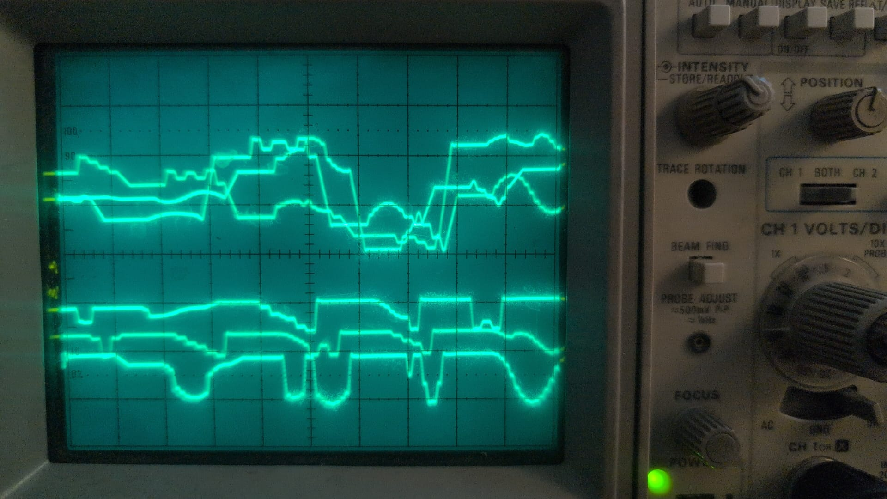

# gplog

RP2040 firmware that plays arbitrary 2D vector paths on an analog oscilloscope used as an XY vector display. The RP2040 streams stereo audio via a PIO-driven I2S DAC at 96 kHz — left/right channels drive the X and Y deflection inputs. A third digital output (GP5) controls beam blanking via the oscilloscope Z input: the beam is turned off during flyback between paths. Paths are defined as sequences of XY integer coordinates (0–16384) in a plain text file specified at build time.

## Hardware wiring

| RP2040 pin | Signal | Destination |
|---|---|---|
| GP2 | I2S BCLK | DAC BCLK |
| GP3 | I2S LRCLK | DAC LRCLK |
| GP4 | I2S DIN | DAC DIN |
| GP5 | Z blanking | Oscilloscope Z input |

DAC left output → oscilloscope X input  
DAC right output → oscilloscope Y input

## Example


## Path file format

```
# One path per line, wrapped in [ ]
# Coordinates: integers 0..16384  (8192 = center of screen)
[0,0, 0,16384, 16384,16384, 16384,0, 0,0]   # rectangle
[0,0, 16384,16384]                            # diagonal
```

- Empty lines and lines starting with `#` are ignored
- Each path is drawn with beam on; flyback between paths has beam off (Z blanking)

Path files can be generated from raster images with [contour2vec](https://github.com/ghedolo/contour2vec).

## Build

```
mkdir -p tmp/build && cd tmp/build
cmake ../.. -DCMAKE_TOOLCHAIN_FILE=../../toolchain-xpack.cmake
make -j$(nproc)
```

To use a custom paths file:
```
cmake ../.. -DCMAKE_TOOLCHAIN_FILE=../../toolchain-xpack.cmake -DPATHS_FILE=/path/to/file.txt
```

## Flashing

### Normal (via run.sh)

```
./run.sh [optional/paths/file.txt]
```

Builds and flashes in one step. No button press needed.

### With serial port busy

If a terminal is already connected to the USB CDC port, the standard 1200-baud trick fails. Use `picotool` instead — it reboots into BOOTSEL even with the port occupied:

```
picotool reboot -f -u
# wait for /Volumes/RPI-RP2 to appear, then:
cp tmp/build/gplog.uf2 /Volumes/RPI-RP2/
```

Or just use the `/flash-gplog` slash command in Claude Code — it always uses `picotool`.

## Slash commands

| Command | Effect |
|---|---|
| `/flash-gplog [file]` | Build and flash (optional custom paths file), no button press required |
| `/commit-gplog` | Update README with fresh dev stats, commit and push |

## Serial commands (USB CDC, 115200 baud)

| Key | Effect |
|---|---|
| `+` / `=` | Increase `z_offset` (beam blanking guard, 0–60) |
| `-` | Decrease `z_offset` |
| `a` | Increase scale (+500, max 32767) |
| `z` | Decrease scale (−500, min 2000) |
| `d` / `c` | Flyback steps ±1 (1–40) |
| `s` / `x` | Draw steps ±1 (1–16) |
| `r` | Reset all to defaults |
| `h` | Print help |

Defaults: `z_offset=18`, `scale=32000`, `flyback=8`, `draw_steps=2`.

### Parameter reference

**`z_offset`** — number of audio samples by which the Z blanking signal is delayed relative to XY. Compensates for the oscilloscope's analog blanking latency: without this delay the beam turns on slightly before the DAC has settled at the target position, leaving a bright dot at the start of each path.

**`flyback`** — number of interpolation steps used to move the beam from the end of one path to the start of the next (beam off). More steps = slower, smoother repositioning. Too few may cause a visible streak if the DAC slews slowly.

**`draw_steps`** — number of interpolation steps between consecutive points inside a path (beam on). More steps = smoother lines at the cost of drawing speed; fewer steps = faster refresh but potentially choppy segments if points are far apart.

## Curiosity

Ever wondered what waveform the DAC actually outputs to draw a picture on an oscilloscope — and what that signal sounds like when played through a speaker?

Here is the raw I2S output of the `space.txt` example, captured on a scope and recorded as audio:

[](material/space_wave.jpg)

[▶ Listen to the sound](material/space_soud.ogg)

The X and Y deflection signals are just stereo audio. The oscilloscope is, in a sense, a speaker that draws instead of vibrating.

## Development effort

### Timeline & commits

| | |
|---|---|
| First commit | 2026-05-06 |
| Last commit | 2026-05-10 |
| Calendar span | ~4 days |
| Commits | 1 |
| Development tool | Claude Code (Anthropic) |

### Source metrics

| File | Lines |
|---|---|
| `main.c` | 245 |
| `renderer.c` | 80 |
| `renderer.h` | 22 |
| `audio_i2s.pio` | 67 |
| `run.sh` | 57 |
| `flash.sh` | 53 |
| `tmp/gen_paths_h.py` | 32 |
| **Total** | **576** |

## License and Credits

**License:** GPL-3.0-or-later

**Author:** ghedo (luca.ghedini@gmail.com) — 2026

**Development Tool:** The project was constructed using Claude Code by Anthropic.
